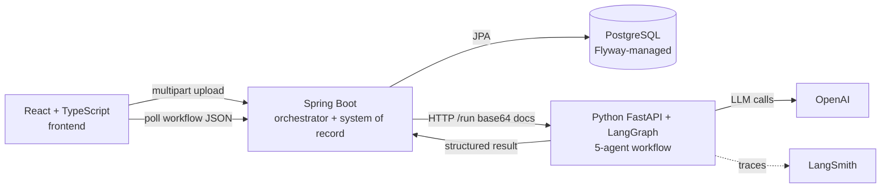
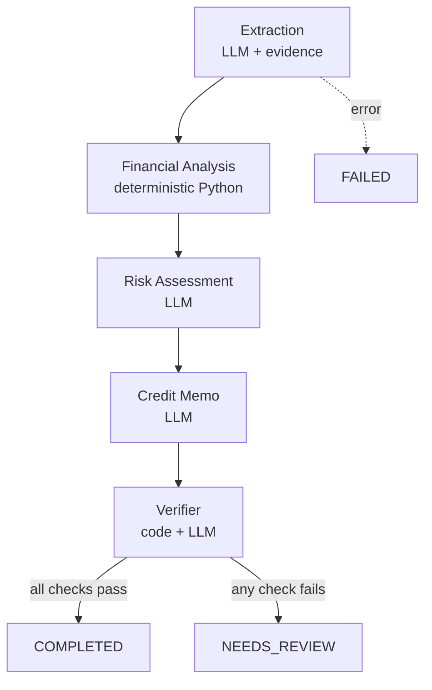

# CreditFlow AI — Architecture (Phase 1)

## Guiding principle

> **Never blindly trust AI.** Agent → Verification → (Human Review) → Approval.

Three rules fall out of that principle and shape every decision:

1. **LLMs read and reason; deterministic code does math and verification.**
2. **Every agent output carries its source evidence** so it can be verified.
3. **The pipeline has a gate** (`COMPLETED` vs `NEEDS_REVIEW`), not just an end.

## Service topology

**Why split this way?** Each service is the best tool for its competency: Spring
for a durable, transactional system of record + orchestration; Python for the AI
(LangGraph/LangChain/PDF libraries are first-class there); React for the human
surface.

## The agent workflow

- **Extraction** — reads PDFs, returns structured fields + raw financial line
  items, each with a verbatim source quote.
- **Financial Analysis** — pure Python. Debt/EBITDA, Current Ratio, Interest
  Coverage. No LLM touches arithmetic.
- **Risk Assessment** — LLM judgment grounded in the computed metrics and
  reference thresholds.
- **Credit Memo** — LLM synthesis, constrained to provided facts.
- **Verifier** — the trust core (below).

## The Verifier

Runs three classes of check and aggregates to an overall status:

| Class | How | Catches |
|-------|-----|---------|
| **Grounding** | deterministic fuzzy match of each evidence quote against the source text | hallucinated extractions |
| **Recomputation** | independently re-derive every ratio and compare | calculation drift |
| **Memo alignment** | LLM compares prose claims to the structured facts | invented numbers / risk drift in the memo |

Any `FAIL` ⇒ the workflow becomes `NEEDS_REVIEW` — the hand-off point to Phase 2's
human review queue.

## Orchestration & async

The upload endpoint returns `202` immediately and processing happens on a Spring
`@Async` thread pool; the frontend polls. A real broker/queue (Kafka/SQS/Temporal)
is deliberately deferred to Phase 2 — building it now would be premature.

## Known Phase 1 limitations (intentional)

- Documents are sent to the AI service as base64 over HTTP — fine for demo sizes;
  object storage + presigned URLs would be the production choice.
- Synchronous single-attempt agent run — no retries/backoff yet.
- No auth/multi-tenancy — out of scope for the core-workflow phase.
