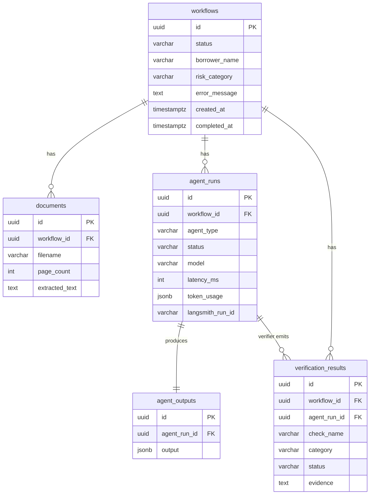

# Database Schema (Phase 1)

Five tables, matching the required entities. UUID primary keys; enums stored as
`VARCHAR` (mapped to Java enums) for painless migrations; `JSONB` for flexible
agent payloads. Source of truth: [`V1__init.sql`](../backend/src/main/resources/db/migration/V1__init.sql).

## Why `agent_runs` and `agent_outputs` are separate

`agent_runs` is **telemetry** (latency, tokens, model, success/failure).
`agent_outputs` is **content** (the structured artifact). Keeping them separate
means a re-run — Phase 2's "learning loop" — creates a new run + new output while
preserving the full history. An audit record is never overwritten.

## Status enums

- `workflows.status`: `PENDING · PROCESSING · COMPLETED · NEEDS_REVIEW · FAILED`
- `agent_runs.status`: `SUCCESS · FAILED`
- `verification_results.status`: `PASS · WARN · FAIL`
- `risk_category`: `LOW · MODERATE · HIGH`
