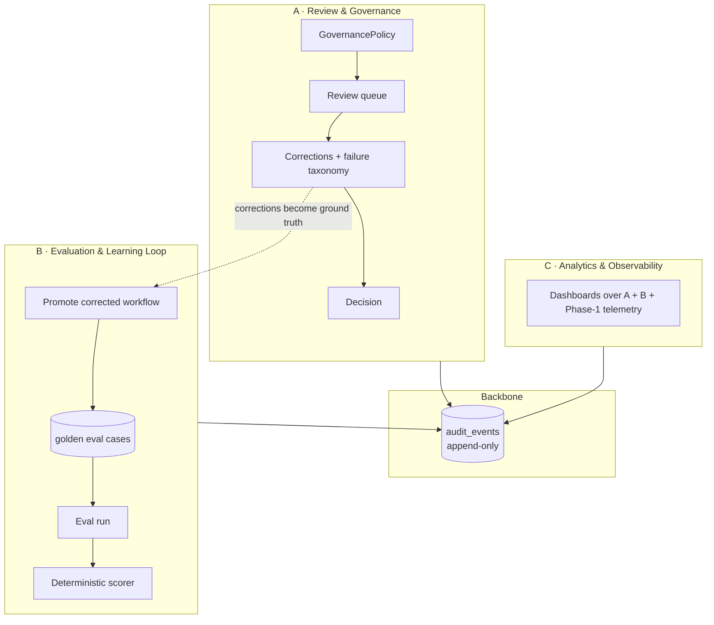

# Phase 2 — Trust, Governance & Learning

Phase 1 ended at a gate (`NEEDS_REVIEW`). Phase 2 is everything around and after
that gate: three subsystems on one append-only **audit backbone**.

## A. Review & Governance

- **Workflow status vs. human decision are separate.** The `reviews` row carries
  `APPROVE/REJECT/REQUEST_CHANGES`; the workflow keeps its AI status. No status explosion.
- **GovernancePolicy** (`application.yml`): `NEEDS_REVIEW` always needs a human;
  `COMPLETED + HIGH risk` needs a human; everything else is auto-approved and recorded.
- **Roles** via `X-Actor`/`X-Role` headers (`ANALYST/REVIEWER/ADMIN`) — only
  REVIEWER/ADMIN can decide. Demo-grade stand-in for real auth.
- **Failure taxonomy** — every correction is tagged (`HALLUCINATED_FIELD`,
  `WRONG_CALCULATION`, `MEMO_DRIFT`, …).

## B. Evaluation & the Learning Loop

The key idea: **human corrections become ground truth.**

1. A reviewer corrects fields on a workflow (Subsystem A).
2. "Promote to dataset" builds a **golden** `expected` = the AI output with those
   corrections applied.
3. An eval run scores the *original* AI output against golden across:
   `extraction_accuracy`, `metric_accuracy`, `risk_agreement`, and the two trust
   metrics — **`verifier_recall`** (did the Verifier flag the fields humans had to
   fix?) and **`verifier_precision`** (were the Verifier's flags real?).

The scorer ([`EvaluationScorer`](../backend/src/main/java/com/creditflow/evaluation/service/EvaluationScorer.java))
is pure and deterministic — no LLM, fully unit-tested.

## C. Analytics & Observability

`GET /api/v1/analytics` aggregates throughput by status, avg latency & tokens per
agent, verification pass/fail rates, review approval rate, failure-category
distribution, and the eval score trend. `GET /api/v1/audit` is the global event feed.

## New tables (`V2` migration)

`audit_events` · `reviews` · `corrections` · `eval_datasets` · `eval_cases` ·
`eval_runs` · `eval_case_results`.

## New API

| Method | Path | Purpose |
|--------|------|---------|
| GET | `/api/v1/reviews?all=` | review queue |
| GET | `/api/v1/reviews/{workflowId}` | review screen (AI output + corrections + audit) |
| POST | `/api/v1/reviews/{workflowId}/assign` | assign to self |
| POST | `/api/v1/reviews/{workflowId}/corrections` | add a human correction |
| POST | `/api/v1/reviews/{workflowId}/decision` | approve / reject / request changes |
| GET | `/api/v1/reviews/failure-categories` | taxonomy values |
| POST | `/api/v1/eval/datasets` · GET list | datasets |
| POST | `/api/v1/eval/datasets/{id}/promote` | learning loop: workflow → golden case |
| POST | `/api/v1/eval/datasets/{id}/run` | run an evaluation |
| GET | `/api/v1/eval/datasets/{id}/runs`, `/api/v1/eval/runs/{id}/results` | results |
| GET | `/api/v1/analytics` | dashboard data |
| GET | `/api/v1/audit` | global audit feed |

## Known Phase 2 limitations (intentional)

- **No real auth** — roles via headers. Real OIDC/JWT is the next step.
- **Policy in config**, not a rules table/engine.
- **Analytics aggregates in memory** over `findAll()` — fine for the demo; SQL
  `GROUP BY` or a reporting table is the production move.
- **Eval scores stored AI outputs**, it does not re-run agents per case — keeps the
  loop deterministic and offline-scoreable.
